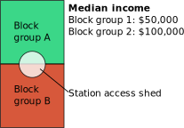
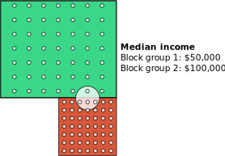

```{r setup, include=FALSE}
knitr::opts_chunk$set(echo = TRUE)
```

A dude on the internet claimed that the Madison BRT project would "not cater to the bottom 2 deciles of income and those are the groups who typically don't have the option of driving." 

# Get data
## BRT route and stations
Data are available on the City of Madison Open Data portal.
- [stations](https://opendata.arcgis.com/datasets/42118889b9af42358071b0485c53bee6_27.zip)
- [routes](https://opendata.arcgis.com/datasets/42118889b9af42358071b0485c53bee6_27.zip)

For purposes of this analysis, it makes sense to focus on the stations -- a bus that passes by your residence but doesn't stop anywhere nearby doesn't do you any good.

```{r}
library(tidyverse)
library(sf)
library(tidycensus)
library(tmap)
```
The dataset contains all stations, including those for planned future lines. I will filter to the ones in the current proposal, the "locally preferred alternative."
```{r}
stations <- read_sf("data/Bus_Rapid_Transit_Stations.shp") %>% 
  filter(LPA == 1)
```

## Population and income data
The American Community Survey has data on income at the block group level. This is a fairly large area for this type of analyses and data at the block level would be preferable. However, only the decennial census provides that level of detail -- which at this point is too old to be useful.

```{r}
vars2018 <- load_variables(2018, "acs5", cache = T)
dp_vars <- load_variables(2018, "acs5/profile", cache = T)
```
Table `B19001` has household income data, providing the number of households in different income brackets. First, we get data for all block groups in Dane County.

```{r}
income <- get_acs("block group", table = "B19001", state = 55, county = "Dane", geometry = T)
```
The median household income for the whole City of Madison is available in the data profile tables. 

```{r}
madison <- get_acs("place", table = "DP03", state = 55) %>% 
  filter(NAME == "Madison city, Wisconsin")

madison %>% filter(variable == "DP03_0062") %>% select(estimate)
```
The median household income in Madison is a little under $63,000. I don't think there is a way to get actual income percentiles from the data. To make the geographic analysis a little easier, I'm just going to focus on median income by block group for now. A reminder that the margin of error at the block group level is very high. 

```{r}
med_inc <- get_acs("block group", 
                   variable = c("B19013_001", "B19001_001"),#median hh income and total number of households
                   state = "WI",
                   county = "Dane",
                   survey = "acs5",
                   geometry = T,
                   keep_geo_vars = T)

```
A quick map of the median income.
```{r}
tm_shape(med_inc) +
  tm_polygons("estimate", alpha = 0.5)
```


# Buffers around stations
To create areas served by BRT stops, as a simple model we create buffers around the stops. How far are people willing to walk to a stop? That's a controversial question. I'll start with the common European spacing of 400 meters.

```{r}
library(units)
buffers <- stations %>% 
  st_transform(3857) %>% 
  st_buffer(set_units(400, metre))
```

```{r}
library(tmap)

tmap_mode("view")
tm_shape(income) +
  tm_polygons(alpha = .3) +
  tm_shape(buffers) +
  tm_polygons(col = "red")
```

# Block group coverage
Most polygons around stations cover multiple block groups. To adequately represent the demographics of a station's access shed, we therefore need a measure of coverage of those blocks. Let's look at the following example.



The station and its access shed are on the boundary between two block groups. One block group has a median income of \$50,000, the other of \$100,000. With half of the access shed in block A and half in block B, one could assign them a weight of 0.5 each and therefore get a median income of $100000*0.5 + 50000*0.5 = 75000$. One may argue that this is too simplistic: What if there are only 100 households in block group A but 10,000 in B? That in itself is not a big problem: Block groups by design have similar population numbers. But they do vary in area, which could lead to scenarios like this:


Here the two block groups both have 49 households, evenly distributed across the area. But because block group A is 4 times as large, only 1 household from block group A but 3 from block group B would be in the access shed. So we should take the household density of each block group and include it in the calculation:

$\frac{\frac{n_{households_A}}{A_A}*A_{Coverage_A}*Income_A + \frac{n_{households_B}}{A_B}*A_{shedCoverage_B}*Income_B}{\frac{n_{households_A}}{A_A}*A_{Coverage_A}+\frac{n_{households_B}}{A_B}*A_{shedCoverage_B}} $

```{r}
med_inc %>% 
  pivot_wider(id_cols = "GEOID", names_from = "variable", values_from = "estimate")
```


The first step is to retrieve the block groups intersecting at all. We'll start with one example polygon.

```{r}
buffer1 <- buffers[1, ] %>% 
  st_transform("NAD83")

```

